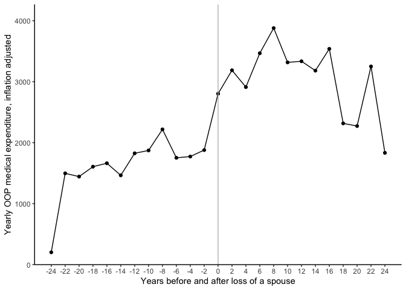

Data Preparation
================
Yanwen Wang
9/2/2021

# Import libraries and the HRS dataset

``` r
library(tidyverse)
options(dplyr.summarise.inform = FALSE)
library(haven)
library(lubridate)
library(MASS)
library(car)

select <- dplyr::select
theme_set(theme_classic())

hrs <- read_sav("randhrs1992_2018v1.sav") %>% 
  select(all_of(Variables))
```

# Clean the dataset

1.  Exclude respondents who didn’t respond but alive in any wave
    (n=28,561)

``` r
hrs <- hrs %>% 
  #Exclude cases with no response but alive
  filter_at(vars(ends_with("IWSTAT")), all_vars(.!=4)) %>% 
  #Exclude cases with no response, don't know if alive or died
  filter_at(vars(ends_with("IWSTAT")), all_vars(.!=9))
```

2.  Exclude respondents and spouses with discrepant marital status in
    any wave (n=27,406)

``` r
hrs <- hrs %>% 
  #Exclude cases with discrepant marital status
  filter_at(vars(ends_with("MSTATF")), all_vars(!(. %in% seq(2, 6))))
```

3.  Select respondents who have married and then widowed (n=3,366)

``` r
hrs_widow <- hrs %>% 
  #Select cases with marital history of only marriage and widowhood
  filter_at(vars((ends_with("MSTATH") & (starts_with("R")))),
            all_vars(. %in% c(NA, 1, 7))) %>%
  #Select cases who entered widowhood in any wave
  filter_at(vars((ends_with("MSTATH") & (starts_with("R")))),
            any_vars(.==7)) %>%
  #Exclude cases who were widows/widowers in all waves
  filter_at(vars((ends_with("MSTATH") & (starts_with("R")))),
            any_vars(.==1))

#Exclude cases who widowed, then married, then died
hrs_diemarried <- hrs_widow %>% 
  select("HHIDPN", crosswave('R%dMSTATH')) %>% 
  pivot_longer(cols = 2:15,
               names_to = "Wave",
               values_to = "Status") %>% 
  group_by(HHIDPN) %>% 
  #Find the last occurrence of a valid marital status
  mutate(Last = last(Wave[!is.na(Status)])) %>% 
  filter(Wave == Last) %>% 
  #Select cases that died married
  filter(Status == 1)

hrs_widow <- hrs_widow[!(hrs_widow$HHIDPN %in% hrs_diemarried$HHIDPN), ]
```

4.  Exclude cases with multiple deceased spouses (n=3,243)

``` r
hrs_widow <- hrs_widow %>% 
  #Select cases with only one spouse in all waves
  filter(RASPCT == 1)
```

5.  Add constant and exit variables of the deceased spouse (n=3,084)

``` r
#Identify the deceased spouses of the widowed
hrs_deceased <- hrs %>% 
  filter(HHIDPN %in% hrs_widow$RASPID1)

#Inner join their constant and exit variables
hrs_widow <- hrs_widow %>% 
  inner_join(hrs_deceased %>% 
               select("HHIDPN", all_of(RA), all_of(Exit)) %>% 
               rename("SHHIDPN" = HHIDPN) %>% 
               #Rename variables names starting with R to S
               rename_with(~gsub("^R", "S", .x)),
             by=c("RASPID1"="SHHIDPN"))
```

6.  Add variables:
    -   RDAge, SDAge (lifespan)
    -   FirstWave (first wave in interview)
    -   FirstWaveM (first wave with a married status)
    -   LastWave (last wave in interview)
    -   WidowWave (first wave widowed after marriage)
    -   WidowAge (age at widowhood after marriage)
    -   MarryLength (length of the current marriage)
    -   MarryAge (age at the start of the current marriage)

``` r
#Add the age of death of both the widowed and the deceased (n=3.059)
hrs_widow <- hrs_widow %>% 
  mutate(RDAge = RADYEAR - RABYEAR,
         SDAge = SADYEAR - SABYEAR) %>% 
  #Exclude cases with the spouse missing death year
  filter(!is.na(SDAge))

attr(hrs_widow$RDAge, "label") <- "RDAge: R death age"
attr(hrs_widow$SDAge, "label") <- "SDAge: S death age"

#Add LastWave
hrs_widow <- hrs_widow %>% 
  inner_join(hrs_widow %>% 
               select("HHIDPN", crosswave('R%dMSTATH')) %>% 
               pivot_longer(cols = 2:15,
                            names_to = "Wave",
                            values_to = "Status") %>% 
               group_by(HHIDPN) %>% 
               #Find the last occurrence of a valid marital status
               mutate(Last = last(Wave[!is.na(Status)])) %>% 
               filter(Wave == Last) %>% 
               mutate(Last = as.numeric(str_extract(Last, "[[:digit:]]+"))) %>% 
               rename("LastWave" = Last) %>% 
               select(HHIDPN, LastWave),
             by="HHIDPN")

attr(hrs_widow$LastWave, "label") <- "LastWave: R Last wave in survey"

#Add FirstWave
hrs_widow <- hrs_widow %>% 
  inner_join(hrs_widow %>% 
               select("HHIDPN", crosswave('R%dMSTATH')) %>%
               pivot_longer(cols = 2:15,
                            names_to = "Wave",
                            values_to = "Status") %>% 
               group_by(HHIDPN) %>% 
               #Find the first occurrence of a valid marital status
               mutate(First = first(Wave[!is.na(Status)])) %>% 
               filter(Wave == First) %>% 
               mutate(First = as.numeric(str_extract(First, "[[:digit:]]+"))) %>% 
               rename("FirstWave" = First) %>% 
               select(HHIDPN, FirstWave),
             by="HHIDPN")

attr(hrs_widow$FirstWave, "label") <- "FirstWave: R first wave in survey"

#Add FirstWaveM
hrs_widow <- hrs_widow %>% 
  inner_join(hrs_widow %>% 
                select("HHIDPN", crosswave('R%dMSTATH')) %>%
                pivot_longer(cols = 2:15,
                             names_to = "Wave",
                             values_to = "Status") %>% 
                group_by(HHIDPN) %>%
                filter(!is.na(Status)) %>% 
                #Find the first occurrence of a married status
                mutate(First = first(Wave[Status==1])) %>% 
                filter(Wave == First) %>% 
                mutate(First = as.numeric(str_extract(First, "[[:digit:]]+"))) %>% 
                rename("FirstWaveM" = First) %>% 
                select(HHIDPN, FirstWaveM),
              by="HHIDPN")

attr(hrs_widow$FirstWaveM, "label") <- "FirstWaveM: R first wave married"

#Add WidowWave
hrs_widow <- hrs_widow %>% 
  inner_join(hrs_widow %>% 
               select("HHIDPN", crosswave('R%dMSTATH')) %>%
               pivot_longer(cols = 2:15,
                            names_to = "Wave",
                            values_to = "Status") %>% 
               group_by(HHIDPN) %>%
               filter(!is.na(Status)) %>% 
               #Find the last occurrence of a married status
               mutate(Last = last(Wave[Status==1])) %>% 
               filter(Wave == Last) %>% 
               #The next wave of the last married status is the first wave widowed
               mutate(Last = as.numeric(str_extract(Last, "[[:digit:]]+")) + 1) %>% 
               rename("WidowWave" = Last) %>% 
               select(HHIDPN, WidowWave),
             by="HHIDPN")

attr(hrs_widow$WidowWave, "label") <- "WidowWave: R first wave widowed"

#Add WidowAge
hrs_widow <- hrs_widow %>% 
  mutate(WidowAge = SADYEAR - RABYEAR)

attr(hrs_widow$WidowAge, "label") <- "WidowAge: R age widowed"

#Add MarryLength, MarryAge (n=3,025)
hrs_widow <- hrs_widow %>% 
  inner_join(hrs_widow %>% 
               select("HHIDPN", crosswave('R%dMCURLN')) %>% 
               pivot_longer(cols = -1,
                            names_to = "Wave",
                            values_to = "Years") %>% 
               group_by(HHIDPN) %>% 
               mutate(Last = last(Wave[!is.na(Years)])) %>% 
               filter(Wave == Last) %>% 
               rename("MarryLength" = Years) %>% 
               select(HHIDPN, MarryLength),
             by="HHIDPN") %>%
  mutate(MarryAge = WidowAge - MarryLength)

attr(hrs_widow$MarryLength, "label") <- "MarryLength: R current marriage length"
attr(hrs_widow$MarryAge, "label") <- "MarryAge: R age start of current marriage"
```

7.  Transform dataset with relevant variables into a long format

``` r
hrs_widowL <- hrs_widow %>% 
  select(all_of(Variables_sorted)) %>% 
  pivot_longer(cols = -c("HHIDPN":"SEHILTC"),
               names_to = c(".value", "Wave", ".value"),
               names_pattern = "([a-z+A-Z+]+)([0-9]+)([a-z+A-Z+]+)") %>% 
  mutate(Wave = as.numeric(Wave)) %>% 
  relocate(Wave, .after=RASPID1) %>% 
  group_by(HHIDPN) %>% 
  arrange(Wave, .by_group=TRUE) %>% 
  ungroup()
```

8.  Adjust for inflation, add OOPMDy (yearly data), WidowWaveR and
    WidowYearR

``` r
hrs_widowL <-  hrs_widowL %>% 
  left_join(yearly_cpi %>% select(wave, adj_factor),
            by=c("Wave"="wave")) %>% 
  mutate_at(Variables_inflation, .funs = funs(. * adj_factor)) %>% 
  #Add OOPMD yearly, WidowWaveR and WidowYearR
  mutate(ROOPMDy = ROOPMD/2,
         SOOPMDy = SOOPMD/2,
         #Set the WidowWave as 0
         WidowWaveR = Wave - WidowWave,
         WidowYearR = WidowWaveR*2) %>% 
  relocate(c("WidowWaveR", "WidowYearR"), .after = WidowWave)
```

# Descriptive Analysis

## Health expenditure before and after the loss of a spouse (unstandardized)

<!-- --><!-- --><!-- -->

# Models

## Linear mixed model
